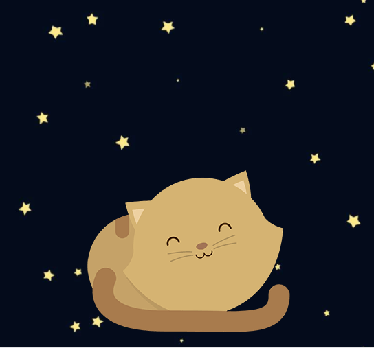

# RETO 1: Kitten

* **Curso:** _Responsive web Design_
* **Unidad 1:** _La web desde el móvil_
* **Tema** _Reto N° 1 -USO DE GRID SYSTEM, MEDIA QUERY Y MEDIA TYPE-_ 

***
## OBJETIVO
* Crea una página web donde se muestre un paisaje y un gatito diferente a medida que la ventana del navegador se haga más pequeña.
*El sitio debe verse de la siguiente forma*

